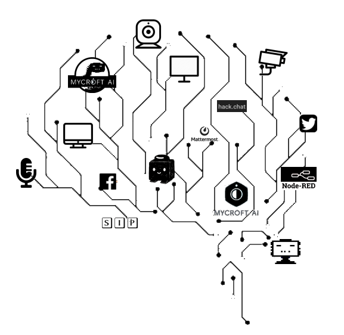
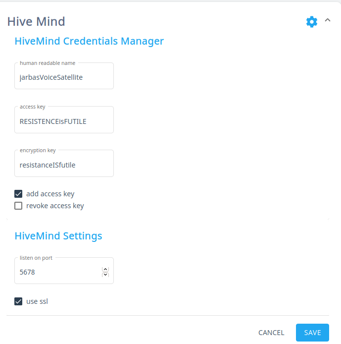

# HiveMind Skill

Mycroft skill for [HiveMind-core](https://github.com/OpenJarbas/HiveMind-core)

Allows the HiveMind ecosystem to talk to a Mycroft instance

## Usage

The following clients are available

NOTE: verify your firewall rules

### Terminals

Terminals will send utterances to mycroft and receive answers

- [Remote Cli](https://github.com/OpenJarbas/HiveMind-cli)
- [Voice Satellite](https://github.com/OpenJarbas/HiveMind-voice-sat)
- [Flask Chatroom](https://github.com/OpenJarbas/HiveMind-flask-chatroom)
- [Webchat](https://github.com/OpenJarbas/HiveMind---Webchat-Terminal)

### Bridges

Bridges will forward utterances and answers between some service and mycroft

- [Mattermost Bridge](https://github.com/OpenJarbas/HiveMind_mattermost_bridge)
- [HackChat Bridge](https://github.com/OpenJarbas/HiveMind-HackChatBridge)
- [Twitch Bridge](https://github.com/OpenJarbas/HiveMind-twitch-bridge)

## Managing Keys

You can add / revoke access keys from web settings

